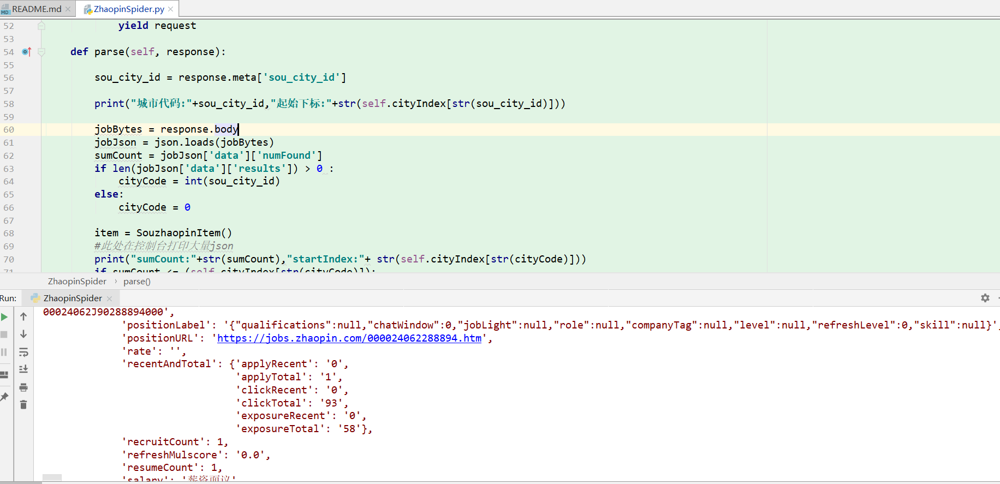
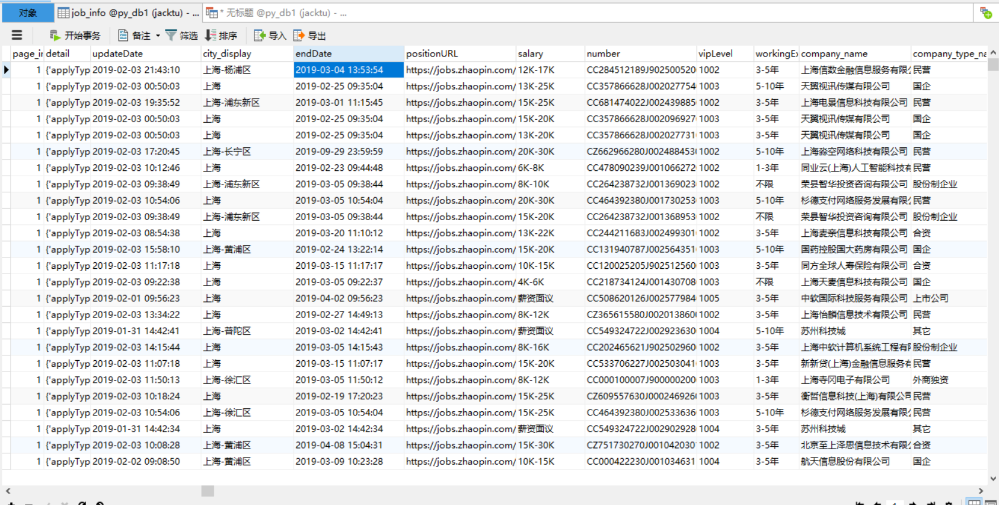

# souZhaopin / 智联爬虫

### [GitHub地址](https://github.com/tu-jacktu/souZhaopin)

### 功能简介
>主要用来爬取智联招聘各个城市的Java职位(改参数就可以爬其他如金融职位)

### 插曲
>写这个爬虫的某天21点 智联网站一度无法访问,还以为是自己的程序问题导致 IP 被封..
<br/> 结果问别人也无法访问 该 PC 端网站
<br/> 过了一会又可以访问,然后发现 智联返回的数据 少了几个属性
<br/> 才知道是智联升级系统

### 技术
- python
- scrapy框架

### 环境
- python 3.7
- scrapy 1.5.1
- MySQL 5.7
- Windows 10

## 启动
- 修改 souZhaopin\souZhaopin\pipelines.py 中数据库连接信息
- 把 souZhaopin\readme\data.sql 中的SQL 放到 MySQL中运行
- 程序入口  souZhaopin/spiders/ZhaopinSpider.py 

## 截图

### 程序运行,控制台输出相关信息


### 保存到数据库的职位信息


### 项目目录
```
│  scrapy.cfg   scrapy 框架配置文件
├─readme
│      1.PNG    截图
│      2.PNG    截图
│      data.sql 数据库文件,导入MySQL数据
├─souZhaopin
│  │  items.py          目标文件,相当于 JavaBean
│  │  middlewares.py    框架生成文件
│  │  pipelines.py      scrapy 框架管道文件
│  │  settings.py       scrapy 框架设置
│  ├─spiders
│  │  │  UnitTest.py        单元测试
│  │  │  ZhaopinSpider.py   程序入口
└─资料收集              写这个所收集的一些资料,算是准备工作
        detail.json
        requestUrl.txt
        result.json

```

